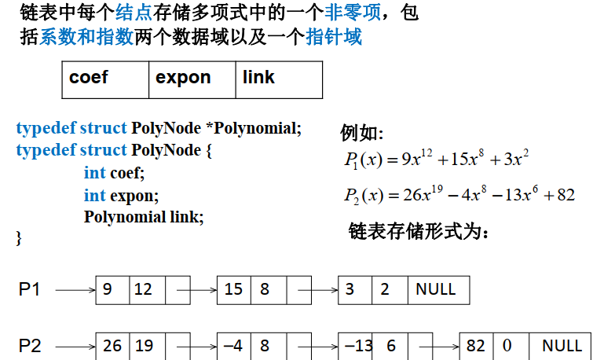
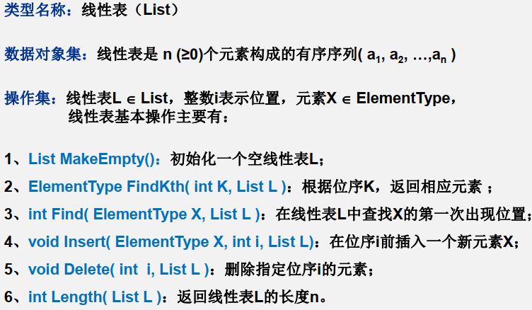
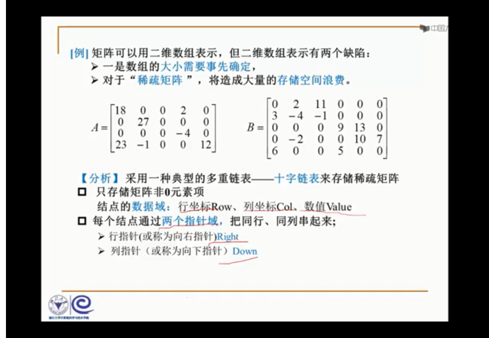
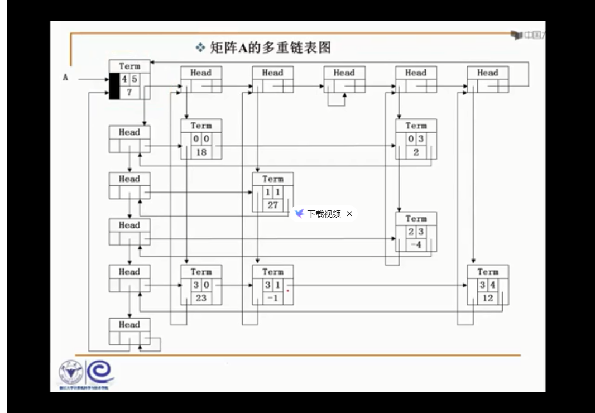
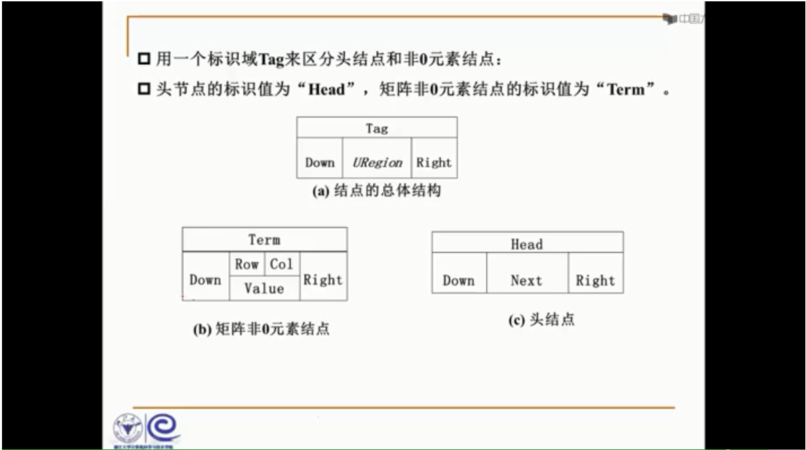
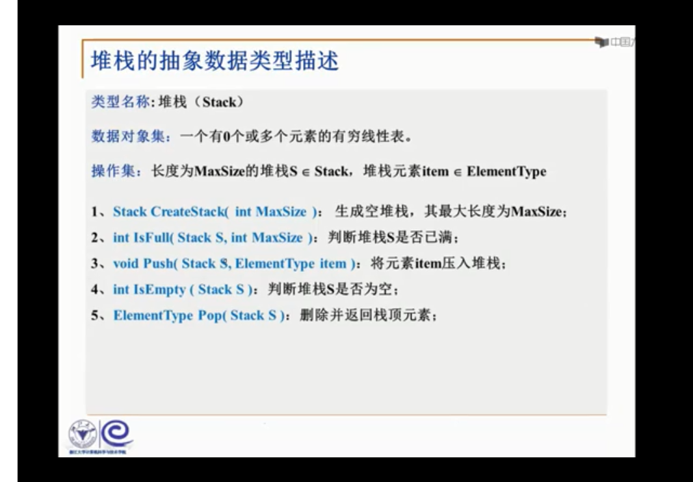

## 第一章

##### 数据结构

​		存储、组织数据的方式.

##### 算法 

​		一个有限指令集，接受输入，产生输出，有限步骤后终止，每一条指令目的明确、计算机计算范围内.

​		空间复杂度S(n)	占用存储单元的长度.

​		时间复杂度T(n)	耗费时间的长度.
$$
T(N)=O(f(n)),存在C>0,n_0>0,使得n \geq n_0时,T(n) \leq C·f(n)
$$

$$
T(N)=\Omega (g(n)),存在C>0,n_0>0,使得n \geq n_0时,T(n) \geq C·g(n)
$$

$$
T(N)=\theta (h(n)),同时有T(N)=O(f(n)) 和 T(N)=\Omega (g(n))
$$

$$
T_1(n)+T_2(n)=max(O(f_1(n)),O(f_2(n)))
$$

$$
T_1(n)*T_2(n)=O(f_1(n)*f_2(n))
$$

$$
若T(n)是关于n的k阶多项式，T(n)=\theta(n^k)
$$

for循环的T(n)=循环次数循环体代码复杂度

if-else结构的复杂度取决于-----if的条件判断复杂度,两个分支部分的复杂度,取三者最大

最大子列和问题:遍历T(n)=O(N^3) ->O(N^2)(前一基础上再取和) -> O(NlogN)分而治之 

​							->O(N)在线处理

```c
#include<stdio.h>
#include<time.h>
#define MAXN 100

clock_t		start, stop;
double		duration;

void printN(int N)
{	/*int i;
	for (i = 1; i <= N; i++) {
		printf("%d\n", i);
	}*/
	if (N) {
		printN(N - 1);
		printf("%d\n",N);
    }
}
int main()
{	start = clock();
	int N=20;
	//scanf_s("%d",&N);
	for ( int i = 0; i <= MAXN; i++)
	{
		printN(N);
	}
	stop = clock();
	duration = ((double)(stop - start)) / CLK_TCK/MAXN;
	printf("ticke1 = %f\n", (double)(stop - start));
	printf("duration1 = %6.2e\n", duration);
	//system("pause");
	return 0;
}
```

## 第二章

### 2.1 线性表及其实现

​		多项式的表示

一元多项式：
$$
f(x)=a_0+a_1x+···+a_n-_1x^n-^1+a_nx^n
$$
主要运算：多项式相加、相减、相乘等

方法1：顺序存储结构直接表示

方法2：顺序存储结构表示非零项

方法3：链表结构存储非零项



线性表：同类型数据元素构成有序序列的线性结构

​			长度，空表，表头、表尾

线性表的抽象数据类型描述



#### 线性表的顺序存储实现(利用数组的连续存储空间顺序存放线性表的各元素)

```c
typedef struct{
    ElenmentType Data[MAXSIZE];
	int Last;
}List;
List L,*Ptrl
```

访问下标为i的元素:L.Data[i]或Ptrl->Data[i]

线性表的长度:L.Last+1或Ptrl ->Last+1

##### 主要操作的实现

###### 1.初始化

```c
List *MakeEmpty()
{	List *PtrL
	Ptrl = (List *)malloc(sizeof(List));
 	Ptrl ->Last=-1;
 	return Ptrl;
}
```

###### 2.查找

```c
int Find(ElementType X,List *Ptrl)
{	int i=0;
	while(i<=Ptrl -> Last && Ptrl -> Data[i]!=X )
	i++;
	if(i>Ptrl -> Last)	return -1;
	else return i;
}
```

###### 3.插入(第i个位置上插入一个值为X的新元素)

```c
void insert(ElementType X,int i,List *Ptrl)
{	int j;
 	if(Ptrl -> Last == MAXSIZE-1){
        printf("表满");
        return;
    }
 	if(i<1||i>Ptrl -> Last+2){
        printf("位置不合法");
        return;
    }
 	for(j=Ptrl -> Last;j>=i-1;j--)
        Ptrl -> Data[j+1] = Ptrl -> Data[j];
 	Ptrl -> Data[i-1]=X;
 	Ptrl -> Last++;
 	return;
}
```

###### 4.删除(删除表的第i个位置上的元素)

```c
void Delete(int i,List *Ptrl)
{	int j;
 	if(i<1 || i>Ptrl -> Last+1){
        printf("不存在第%d"个元素,i);
        return;
    for(j=i;j<=Ptrl->Last;j++)
        Ptrl -> Data[j-1] = Ptrl -> Data[j];
    Ptrl -> Last--;
    return;
}
```

#### 线性表的链式存储实现

##### 主要操作的实现

###### 1.求表长

```c
int Length ( List *PtrL )
{	List *p = PtrL; 		/* p指向表的第一个结点*/
	int j = 0;
	while ( p ) {
		p = p->Next;
		j++; 				/* 当前p指向的是第 j 个结点*/
	}
	return j;
}
```

###### 2.查找

按序号查找

```c
List *FindKth( int K, List *PtrL )
{ 	List *p = PtrL;
	int i = 1;
	while (p !=NULL && i < K ){
		p = p->Next;
		i++;
	}
	if ( i == K ) return p;
			/* 找到第K个，返回指针 */
	else return NULL;
			/* 否则返回空 */
}
```

按值查找

```c
List *Find( ElementType X, List
*PtrL )
{
	List *p = PtrL;
	while ( p!=NULL && p->Data != X )
		p = p->Next;
	return p;
}
```

###### 3.插入

```c
List *Insert( ElementType X, int i, List *PtrL )
{ 	List *p, *s;
	if ( i == 1 ) { 						/* 新结点插入在表头 */
		s = (List *)malloc(sizeof(List)); 	/*申请、填装结点*/
        s->Data = X;
        s->Next = PtrL;
		return s; 							/*返回新表头指针*/
	}
    p = FindKth( i-1, PtrL ); 				/* 查找第i-1个结点 */
    if ( p == NULL ) { 						/* 第i-1个不存在，不能插入 */
        printf(＂参数i错＂ );
        return NULL;
    }else {
        s = (List *)malloc(sizeof(List)); 	/*申请、填装结点*/
        s->Data = X;
        s->Next = p->Next;				/*新结点插入在第i-1个结点的后面*/
        p->Next = s;
        return PtrL;
}
```

###### 4.删除

```
List *Delete( int i, List *PtrL )
{	List *p, *s;
    if ( i == 1 ) { 			/* 若要删除的是表的第一个结点 */
        s = PtrL; 				/*s指向第1个结点*/
        if (PtrL!=NULL) PtrL = PtrL->Next; /*从链表中删除*/
        else return NULL;
        free(s); 				/*释放被删除结点 */
        return PtrL;
    }
    p = FindKth( i-1, PtrL ); 	/*查找第i-1个结点*/
    if ( p == NULL ) {
    	printf(“第%d个结点不存在”, i-1); return NULL;
    } else if ( p->Next == NULL ){
    	printf(“第%d个结点不存在”, i); return NULL;
    } else {
        s = p->Next; 			/*s指向第i个结点*/
        p->Next = s->Next; 		/*从链表中删除*/
        free(s); 				/*释放被删除结点 */
        return PtrL;
}
```

#### 广义表(Generalized List)  

​	1.广义表是线性表的推广
​	2.对于线性表而言， n个元素都是基本的单元素；
​	3.广义表中，这些元素不仅可以是单元素也可以是另一个广义表。  

```
typedef struct GNode{
	int Tag; 			/*标志域： 0表示结点是单元素， 1表示结点是广义表 */
    union { 		/* 子表指针域Sublist与单元素数据域Data复用，即共用存储空间 */
        ElementType Data;
        struct GNode *SubList;
    } URegion;
    struct GNode *Next; /* 指向后继结点 */
} GList;
```

#### 多重链表

多重链表： 链表中的节点可能同时隶属于多个链
		多重链表中结点的指针域会有多个，如前面例子包含了Next和SubList两个指针域；
		但包含两个指针域的链表并不一定是多重链表，比如在双向链表不是多重链表。
多重链表有广泛的用途：基本上如树、图这样相对复杂的数据结构都可以采用多重链表方式实现存储。  






### 2.2 堆栈(Stack):具有一定操作约束的线性表

中缀表达式： 运算符号位于两个运算数之间。 如 ， a+b*c-d/e

后缀表达式： 运算符号位于两个运算数之后。如， a b c * +d e /  -

后缀表达式求值策略：从左向右“扫描”，逐个处理运算数和运算符号

​				遇到运算数怎么办？如何“记住”目前还不未参与运算的数？

​				遇到运算符号怎么办？对应的运算数是什么？
启示： 需要有种存储方法，能顺序存储运算数，并在需要时“倒序”输出

只在一端（栈顶， Top）做 插入、删除  

插入数据： 入栈（Push）, 删除数据： 出栈（Pop）, 后入先出： Last In First Out（LIFO）




#### 栈的顺序存储实现

​	由一个一维数组和一个记录栈顶元素位置的变量组成

```c
#define MaxSize <储存数据元素的最大个数>
typedef struct {
        ElementType Data[MaxSize];
        int Top;
} Stack;
```

###### 1.入栈

```c
void Push( Stack *PtrS, ElementType item )
{
	if ( PtrS->Top == MaxSize-1 ) {
		printf(“堆栈满”); return;
	}else {
        PtrS->Data[++(PtrS->Top)] = item;
        return;
    }
}
```

###### 2.出栈

```c
ElementType Pop( Stack *PtrS )
{
    if ( PtrS->Top == -1 ) {
        printf(“堆栈空”);
        return ERROR; 			/* ERROR是ElementType的特殊值，标志错误*/
    } else
    	return ( PtrS->Data[(PtrS->Top)--] );
}
```

pl.用一个数组实现两个堆栈,要求最大地利用数组空间,使数组只要有空间入栈操作就可以成功

​		一种比较聪明的方法是使这两个栈分别从数组的两头开始向中间生长；当两个栈的栈顶指针相遇时，表示两个栈都满了。  

```c
#define MaxSize <存储数据元素的最大个数>
struct DStack {
    ElementType Data[MaxSize];
    int Top1; /* 堆栈１的栈顶指针 */
    int Top2; /* 堆栈２的栈顶指针 */
} S;
S.Top1 = -1;
S.Top2 = MaxSize;
```

```c
void Push( struct DStack *PtrS, ElementType item, int Tag )
{ 				/* Tag作为区分两个堆栈的标志，取值为1和2 */
    if ( PtrS->Top2 – PtrS->Top1 == 1) {	/*堆栈满*/
   		printf(“堆栈满”); return ;
    }
    if ( Tag == 1 ) 						/* 对第一个堆栈操作 */
    	PtrS->Data[++(PtrS->Top1)] = item;
    else 									/* 对第二个堆栈操作 */
    	PtrS->Data[--(PtrS->Top2)] = item;
}
```

```c
ElementType Pop( struct DStack *PtrS, int Tag )
{ 							  /* Tag作为区分两个堆栈的标志，取值为1和2 */
    if ( Tag == 1 ) { 							/* 对第一个堆栈操作 */
        if ( PtrS->Top1 == -1 ) { 				/*堆栈1空 */
       		printf(“堆栈1空”); return NULL;
    	} else return PtrS->Data[(PtrS->Top1)--];
    } else { 									/* 对第二个堆栈操作 */
    	if ( PtrS->Top2 == MaxSize ) { 			/*堆栈2空 */
    		printf(“堆栈2空”); return NULL;
    	} else return PtrS->Data[(PtrS->Top2)++];
    }
}
```

